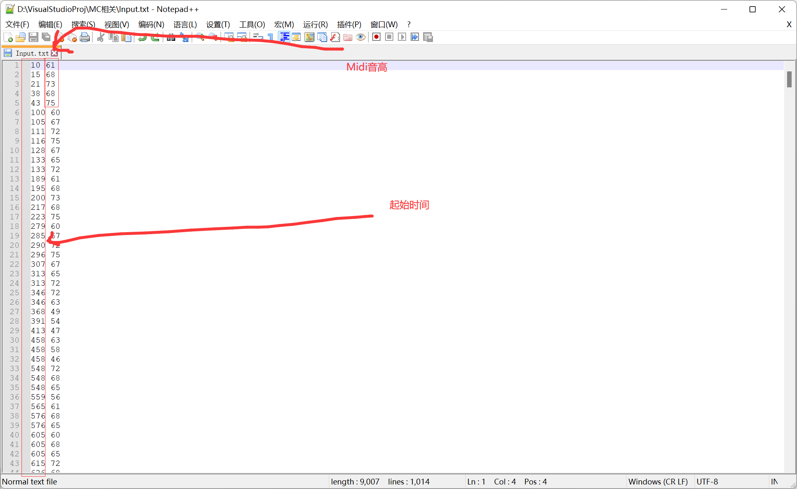

# 我的世界粒子特效Midi播放器

#### 介绍
我的世界粒子特效Midi播放器（粒子特效指令音乐）生成程序（C++）

此函数库目前包含的基础线条：
1、直线（普通直线和伪倒影效果直线）
2、抛物线（普通抛物线和伪倒影效果抛物线与结束点圈阵的抛物线）
3、正弦/余弦曲线。
4、螺线与螺线组。
5、平面连续相切圆和带有Y轴的连续相切圆
6、笛卡尔叶形线
7、星型线
8、倒映形线条
9、其他内容请自行探索

目前实现的尾部特效：
1、扩大的圆圈
2、螺旋线
3、星星
4、心形线
5、蝴蝶（翅膀会飞，会动的）
6、其他内容请自行探索

此函数库计划加入：
1、贝塞尔曲线。
2、傅里叶变换曲线。

测试视频地址：
[演示1](https://www.bilibili.com/video/BV11y4y1L7jT)
[演示2](https://www.bilibili.com/video/BV1uT4y1P7CX)

#### 软件架构
仅包含.h头文件
需要自己创建C++（Cpp）文件并使用主函数调用头文件中函数
不存在.exe可执行文件

#### 安装教程
1.  安装带有C++语言的IDE
2.  克隆该项目
    i）：下载Particle_Music文件夹中所有文件
   ii）：下载发布版本中zip并解压
3.  安装Minecraft - 1.16.5（Fabric）
4.  下载ColorBlock（1.16.5-Fabric）[点我下载](https://www.mcbbs.net/thread-917845-1-1.html)
5.  按照说明中的提示调用函数

#### 注意事项
1.  调用实参为（起点X，终点X，起点Y，终点Y，起点Z，终点Z，测试数值（填10是最完美的），文件名（在本版本中无作用，是迁移高版本后遗留的参数））
2.  需要加载colorblock Mod才可以正常运行，纯原版运行的版本由于性能原因已被淘汰（因为会生成等同你的音乐时长（秒）* 20的文件数量，会占用极大的系统内存）
3.  需要自行创建mcfuciton的路径，总之就是你存档文件夹的datapacks里的function文件夹。

#### 使用说明（纯特效线条函数，即particle.h）
1.  按照以上方法安装完毕后，进入Minecraft - 1.16.5，新建一个地图，并创建一个名为Timer的计分板
2.  将项目中的datapack文件夹复制入新建世界的存档文件中
3.  在项目中创建一个源文件（.cpp）引用Particle.h 在其下创建一个主函数（main）
4.  在main函数头部写入文件打开函数，路径大概为（???:\\你的MC路径\\.minecraft\\save\\你的存档名\\datapacks\\particlemidipiano\\data\\other_music_own\\functions\\自定义名.mcfunction）
如果不想手动调用，在我这里有个自动调用的表格，连续相切圆使用方法如下

普通线条如下：

#### 使用说明（带向导的自动化生成，即MCPARTICLEMIDIPLAYERMAINCONTROL.h）
1.  按照以上方法安装完毕后，进入Minecraft - 1.16.5，新建一个地图，并创建一个名为Timer的计分板。
2.  将项目中的datapack文件夹复制入新建世界的存档文件中。
3.  复制项目至一个文件夹，并在项目中创建一个源文件（.cpp）引用MCPARTICLEMIDIPLAYERMAINCONTROL.h 在其下创建一个主函数（main）。
4.  在main函数头部调用函数StartProject（普通线条）或者StartRound（连续相切圆），第一次调用会在根目录创建一个名为input.txt的文件。
5.  打开input.txt，使用工具提取Midi的音符（建议使用Audio2Minecraft）将其中的起始时间一列与Midi音高一列复制入该文件（每一行为 起始时间 Midi音高，如下图），需要将其中制表符替换为空格。

6.  再次运行函数，会在根目录生成一个Temp.mcfunction的文件，重命名之，将其中Temp改为纯小写字母组成的字符串。
7.  放入datapack的function文件夹内，进入存档，使用循环命令方块调用
（不包含播放声音的函数，是因为大家用的音源资源包都不一样，如果需要以后会加上）

#### 一些必须了解的基础知识
1.  MC刻（tick）：MC游戏的时间单位为tick，它与现实中秒的对应关系为20:1，即mc是以20的tps（tick per second）运行
2.  MCFUNCTION ：MC高版本提供的一个新功能，可以简单的理解为多个指令的集合，它可以实现用一条指令执行多条指令
3.  MCDATAPACK ：MC高版本新功能，数据包，可以对原版内容进行修改，可以定义自己的Mcfunction

#### 作者的话
目前在搞MC计算机，以及一些其他有趣的项目，所以以后可能会退坑MC音乐，Midi也不会怎么做了（我是因为对Summer Pockets的女主鳴瀬しろは的爱才去做这么多的midi），以后可能在这些地方不会再活跃，希望这方面的新人们能给大家带来更好的作品。

